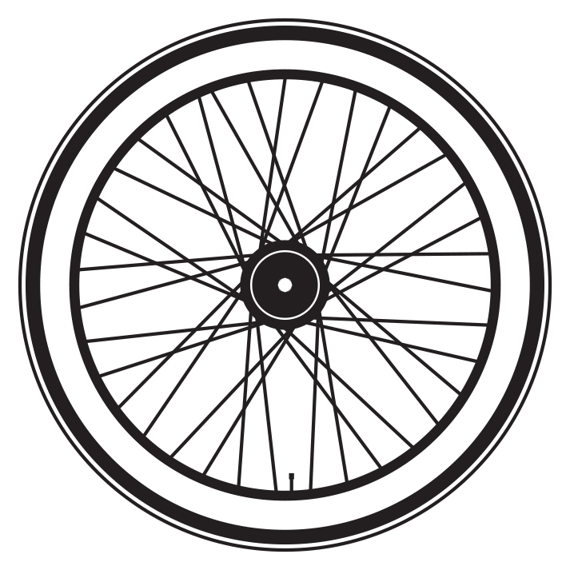

# Infinity-Wheel

This repository contains the code for a web page that features an infinite spinning wheel animation. The purpose of the project is to create an engaging visual effect for the user.

## Getting Started

To use this code, simply copy the entire HTML file and save it with the `.html` extension. You can then open the HTML file in any web browser to see the spinning wheel animation.

## Prerequisites

No special prerequisites are required to run this code. Any modern web browser should be able to render the HTML and display the spinning wheel animation correctly.

## Usage

Once you have the HTML file open in a web browser, you will see the spinning wheel animation on the page. The wheel continuously rotates from left to right.

## Customization

If you want to customize the appearance or behavior of the spinning wheel, you can modify the following parts of the code:

### Background Color

To change the background color of the page, you can modify the `background-color` property in the CSS section:

```css
body {
    background-color: aqua;
}
```

Replace `"aqua"` with the desired color value.

### Text Alignment and Font

The text displayed above the wheel can be customized by modifying the CSS properties for the `p` selector:

```css
p {
    text-align: center;
    font-family: cursive;
}
```

You can change the `text-align` property to `"left"`, `"center"`, or `"right"` to align the text differently. The `font-family` property can be modified to use a different font for the text.

### Image Source

The spinning wheel animation is displayed using an image. You can replace the `src` attribute of the `img` tag to use a different image:

```html

```

Replace `"wheel-animation.gif"` with the path or URL to your desired image file.

### Animation Speed and Direction

The animation speed and direction can be adjusted by modifying the JavaScript code section:

```javascript
let i = 0
setInterval(() => {
    i = i+10;
    if(i == 1500) {
        i = -700;
    } else {
        document.getElementById("obj").style.marginLeft = i + "px";
    }
}, 100);
```

The `100` value in `setInterval` represents the interval in milliseconds between each frame of the animation. You can increase or decrease this value to speed up or slow down the animation.

The `i = i+10` statement determines how many pixels the wheel moves in each frame. Increasing the value will make the wheel move faster, while decreasing it will slow it down.

The `if` condition checks if the wheel has reached a certain position (`1500` pixels in this case) and resets it to a different position (`-700` pixels) to create an illusion of infinite scrolling. You can modify these values to change the distance and direction of the wheel's movement.

## Acknowledgements

The spinning wheel animation used in this project is obtained from an external source. Special thanks to the creator of the animation.
